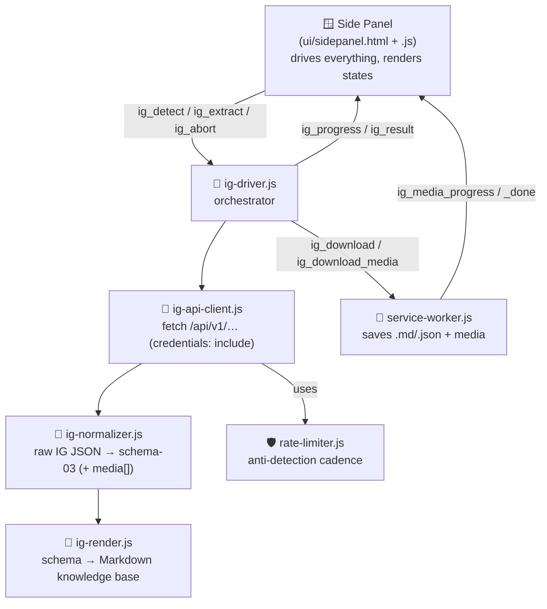

<div align="center">

# 👻 InstaGhost

### The free, open-source **Instagram scraper** Chrome extension — turn any Instagram profile into an LLM-ready knowledge base.

**No API keys. No paid plans. No external servers.** Your browser, your session, your data.

[](LICENSE)
[](manifest.json)
[](#-installation)
[](#-how-it-works)
[](#-contributing)


[**What it does**](#-what-it-does) · [**Features**](#-features) · [**Install**](#-installation) · [**How it works**](#-how-it-works) · [**vs Apify**](#-instaghost-vs-apify-vs-the-official-api) · [**FAQ**](#-faq)

</div>

---

## 🧭 What is InstaGhost?

**InstaGhost is a free Instagram scraper that runs entirely as a Chrome extension (Manifest V3).** Give it an Instagram handle and a number of posts, and it produces a clean, **LLM-ready Markdown knowledge base** (plus a structured JSON dataset and, optionally, the original photos and videos).

It is built as the **do-it-yourself, zero-cost alternative to paid Instagram scrapers** like the Apify Instagram Scraper — but instead of renting a cloud actor and paying per run, InstaGhost lives inside **your own already-logged-in Instagram session** and asks Instagram for the exact same data the website asks itself (the internal web APIs). Nothing leaves your browser.

> **In one line:** an **Instagram profile scraper** that exports posts, captions, comments, hashtags, locations and engagement into Markdown you can paste straight into ChatGPT or Claude — locally, privately, for free.

---

## ✨ What it does

Given a handle (e.g. `@nasa`) and a number **N** of posts (newest first), InstaGhost generates:

| Output | What's inside |
|---|---|
| 📝 **`<handle>-<timestamp>.md`** | An **LLM-optimized knowledge base**. **Part 1 — Indexes:** geolocated places, places named in captions (📌), mentioned accounts/venues, recurring hashtags, posts grouped by theme. **Part 2 — Posts:** every post in chronological order with caption, engagement, location, audio, co-authors, paid-partnership flag and top comments. |
| 🗂️ **`<handle>-<timestamp>.json`** | The full **normalized dataset** (schema-03), including a `media[]` array with the direct photo/video URLs. |
| 🖼️ **`@<handle>/…`** *(optional)* | The actual **media files** — every photo and video, including all carousel slides — when you flip the "Photos & videos" toggle. |

The `.md` / `.json` files are saved automatically to your Downloads folder and are also available in the side panel (copy to clipboard / explicit download).

---

## 🚀 Features

- 🆓 **100% free & open source** — no subscription, no credits, no rate-limited free tier. MIT licensed.
- 🔌 **No API key, no official Instagram API** — works from your logged-in browser session using Instagram's own internal web endpoints.
- 🤖 **LLM-ready output** — Markdown structured for ChatGPT, Claude, Gemini & RAG pipelines, not raw dumps.
- 📍 **Rich extraction** — posts, **captions**, **top comments**, **hashtags**, **@mentions**, **geolocations**, reels audio, co-authors, paid-partnership flags and engagement metrics.
- 🌍 **Bilingual theme classifier** — automatically groups posts into themes (Food & drink, Events, Things to do, Books & culture) for both English and Italian profiles.
- 🖼️ **Optional media download** — grab the original photos and videos, every carousel slide included.
- 🛡️ **Built-in anti-detection** — human-like Gaussian request pacing, progressive fatigue and exponential backoff to protect your account.
- 🔒 **Private by design** — no servers, no telemetry, no tracking. Everything stays on your machine.
- 🧩 **Zero dependencies** — plain JavaScript, Manifest V3, ~7 small files. Easy to audit, easy to fork.

---

## 📸 Sample output

````markdown
# Instagram knowledge base — @testcafe (Test Cafe)

> 12,500 followers · 340 total posts · 60 extracted (chronological, newest first) · Cafe
> Bio: Coffee & books
> Extracted: 2026-06-02T10:00:00.000Z · Source: Instagram (public data)

# PART 1 — Indexes

## 🗺️ Tagged places (geolocated)
- **Downtown Roastery** (44.49, 11.34) — 8 posts: #1, #4, #9 …

## 🧭 Posts by theme
- **🍽️ Food & drink** (41): #1, #2, #3 …
- **🎭 Events** (12): #5, #11 …

# PART 2 — Posts (chronological)

## #1 · 2026-05-30 · image
🧭 🍽️ Food & drink
📍 **Downtown Roastery**
📊 230 likes · 12 comments
**Caption:**
Best single-origin in town ☕ …
````

Paste it into your favourite LLM and ask: *"Build me a neighbourhood food guide from this profile."*

---

## 📦 Installation

> InstaGhost is a developer-mode (unpacked) Chrome extension. It is **not** on the Chrome Web Store — you load it directly from source, which keeps it free and fully auditable.

1. **Download the code** — clone or [download the ZIP](https://github.com/uppifyagency/instaghost/archive/refs/heads/main.zip):
   ```bash
   git clone https://github.com/uppifyagency/instaghost.git
   ```
2. Open `chrome://extensions/` and enable **Developer mode** (top-right).
3. Click **Load unpacked** and select the project folder.
4. The 👻 icon appears in your toolbar — click it to open the **side panel**.

> Works in any Chromium browser (Chrome, Edge, Brave, Arc, Opera).
> Chrome won't load extensions containing files/folders that start with `_`; the archived legacy code lives in [`legacy/`](legacy/) (no underscore) and is never loaded.

---

## 🖱️ Usage

1. Open **instagram.com** and log in (the logged-in session is required).
2. Go to the profile you want to scrape — the handle is **auto-detected** — or type it into the panel.
3. Choose **how many posts** (newest first) and the toggles:
   - **Top comments** (ON by default) — adds the top 5 comments per post.
   - **Photos & videos** (OFF by default) — also downloads the media files.
4. Hit **✨ Extract**. The panel shows step-by-step progress (Profile → Posts → Comments).
5. When it's done: **Copy the Markdown** (paste it into your LLM) or download `.md` / `.json`. Media, if enabled, lands in `Downloads/@<handle>/`.

---

## 🧱 How it works

InstaGhost uses a "Driver A" architecture: a content script asks Instagram's **internal web APIs** for data, using your first-party cookies (same-origin, from the isolated content-script world). No DOM scraping, no headless browser, no third-party proxy.



**Endpoints used** (internal web APIs, from your logged-in session):

| Endpoint | Returns |
|---|---|
| `GET /api/v1/users/web_profile_info/?username=X` | profile + `userId` |
| `GET /api/v1/feed/user/{userId}/?count=N&max_id=…` | paginated posts |
| `GET /api/v1/media/{mediaId}/comments/` | comments |

**Runtime file structure:**

```
manifest.json                  # MV3, v2.0.0
background/service-worker.js   # opens the panel + downloads (.md/.json + media)
content/
  ig-driver.js                 # content-side orchestrator
  ig-api-client.js             # internal API client + RateLimiter
  ig-normalizer.js             # raw IG → schema (profile/post/comment/media)
  ig-render.js                 # schema → Markdown knowledge base
libs/
  rate-limiter.js              # anti-detection engine
ui/
  sidepanel.html / .js         # single-purpose UI + state controller
icons/                         # 16 / 48 / 128
```

---

## 🛡️ Anti-detection

The block risk is on **the logged-in account making the requests**, so [`libs/rate-limiter.js`](libs/rate-limiter.js) makes traffic look human:

- **Gaussian-distributed delays** (Box-Muller) seeded by a CSPRNG, so timing isn't a detectable uniform-random fingerprint.
- Random **"distraction pauses"** and **"quick reactions"** that mimic real attention drift.
- **Progressive fatigue** — the extension gradually slows down the longer a session runs.
- **Exponential backoff + safe mode** on `429` / `503` responses. State is persisted to `chrome.storage.local`.

Even so: use it gently. See [Responsible use](#-privacy--responsible-use) below.

---

## ⚖️ InstaGhost vs Apify vs the official API

| | 👻 **InstaGhost** | 💰 Apify Instagram Scraper | 🏢 Official Graph API |
|---|---|---|---|
| **Cost** | Free, open source | Pay per run / monthly credits | Free tier, then quotas |
| **Setup** | Load unpacked extension | Account + actor config | App review + tokens |
| **API key** | ❌ Not needed | ✅ Apify token | ✅ App + access token |
| **Runs on** | Your browser, locally | Apify cloud | Meta servers |
| **Data location** | Stays on your machine | Apify cloud storage | Meta |
| **Public profiles** | ✅ | ✅ | ⚠️ Limited / business only |
| **LLM-ready Markdown** | ✅ Built in | ❌ Raw JSON | ❌ Raw JSON |
| **Best for** | Personal research, LLM prep | Large-scale automation | Approved business apps |

If you searched for a **free Apify Instagram scraper alternative** or an **Instagram scraper without an API**, InstaGhost is built for exactly that use case.

---

## ❓ FAQ

**What is InstaGhost?**
A free, open-source Chrome extension that scrapes a public Instagram profile — its posts, captions, comments, hashtags, locations and engagement — and exports everything to LLM-ready Markdown and JSON, running entirely in your browser.

**Is InstaGhost free?**
Yes. It's MIT-licensed and has no paid tier, no credits and no account to create. You load it as an unpacked Chrome extension.

**Do I need an Instagram API key or developer account?**
No. InstaGhost does not use the official Instagram/Graph API. It reuses your normal logged-in browser session, so there are no tokens to manage.

**Can it scrape private Instagram profiles?**
No. It can only read what your account can already see. Private profiles you don't follow return no posts, by design.

**Does it work for Instagram reels, comments and hashtags?**
Yes — it captures posts and reels (with audio metadata), the top comments per post, all hashtags and @mentions, plus geotagged locations.

**Will scraping Instagram get my account banned?**
Any automation carries risk. InstaGhost ships with human-like rate limiting and backoff to minimise it, but you should still use it in moderation — one profile at a time, a reasonable N — and ideally not on your primary account.

**Where is my data stored?**
Only in your browser and your Downloads folder. There are no external servers, no telemetry and no tracking.

**Which browsers are supported?**
Any Chromium-based browser: Google Chrome, Microsoft Edge, Brave, Arc and Opera.

**How is this different from the Apify Instagram Scraper?**
Apify runs in the cloud and charges per run; InstaGhost runs locally in your browser for free and outputs Markdown designed for LLMs. See the [comparison table](#-instaghost-vs-apify-vs-the-official-api).

---

## 🔐 Permissions

`storage` · `activeTab` · `scripting` · `downloads` · `sidePanel` · `tabs` ·
host `https://www.instagram.com/*`.

Each permission maps to a concrete need: download the files, open the side panel, talk to the active Instagram tab, and persist anti-detection state locally. No broad host access, no analytics.

---

## ⚠️ Privacy & responsible use

> Please read this before using InstaGhost.

- **Personal use.** Extracted data is public, but it stays yours — don't redistribute it, and respect Instagram's Terms of Service and applicable laws (including GDPR where relevant).
- **Your account is the "fuse."** Requests originate from your session; heavy use can lead to rate-limiting or a block **of your account**. Use moderation and avoid your most important account.
- **Unstable endpoints.** These are undocumented internal APIs: Instagram can change them without notice and the extension may need updating.
- **Everything local.** No server, no telemetry. The `.md` / `.json` / media files live only in your Downloads.

InstaGhost is provided for educational and personal research purposes, "as is", without warranty. You are responsible for how you use it.

---

## 🤝 Contributing

PRs and issues are welcome! Good first contributions:

- Add more languages to the theme classifier in [`content/ig-render.js`](content/ig-render.js) (the keyword dictionaries are bilingual EN/IT today).
- Improve resilience when Instagram changes its endpoints.
- New export formats (CSV, Notion, etc.).

The rate-limiter has Node tests: `node libs/test-backoff.js` and `node libs/test-fatigue.js`. Design notes (SSOT) live in [`docs/apify-parity/`](docs/apify-parity/).

---

## 📄 License

[MIT](LICENSE) © 2026 InstaGhost contributors. Free to use, modify and share.

---

<div align="center">

<sub><b>Keywords:</b> instagram scraper · instagram profile scraper · instagram posts scraper · instagram comment scraper · instagram reels scraper · instagram hashtag scraper · free instagram scraper · instagram scraper chrome extension · instagram scraper without API · instagram data scraper · apify instagram scraper alternative · instagram to markdown · export instagram to LLM</sub>

<br/><br/>

Made for everyone who wanted an Instagram scraper that's **free, private and actually yours.** 👻

</div>
