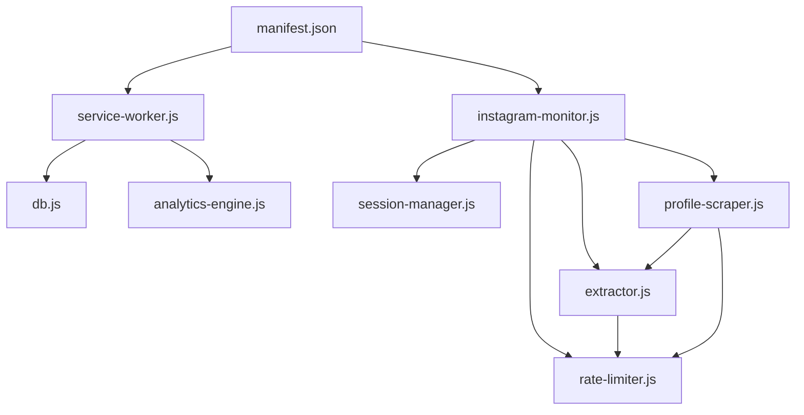

# 🔧 InstaGhost Implementation Guide

## NSA-Grade Reference Document

> **Scopo**: Guida di riferimento per l'implementazione di ogni fase dell'evoluzione InstaGhost.  
> **Formato**: Per ogni feature → **DOVE** (file), **COME** (codice), **PERCHÉ** (rationale)

---

## 📁 Project Structure Map

```
Insta_ghost/
├── manifest.json                    # Extension config (permissions, CSP)
├── background/
│   ├── service-worker.js            # Message routing, exports, DB init
│   └── db.js                        # IndexedDB layer (posts, sessions)
├── content/
│   ├── instagram-monitor.js         # MutationObserver, post detection
│   ├── extractor.js                 # DOM data extraction
│   ├── profile-scraper.js           # Profile page scraping
│   └── styles.css                   # Injected CSS (notifications)
├── libs/
│   ├── lru-cache.js                 # Memory-efficient caching
│   └── rate-limiter.js              # Token bucket rate limiting
└── ui/
    ├── sidepanel.html               # UI structure
    ├── sidepanel.js                 # UI logic
    └── sidepanel.css                # UI styles
```

---

# PHASE 1: Anti-Detection Excellence

## 1.1 Behavioral Intelligence Engine

### 🎯 OVERVIEW
Trasforma i delay da uniformi (rilevabili) a distribuzione gaussiana con pattern umani.

---

### Feature 1.1.1: Gaussian Delay Distribution

**📍 DOVE**: `libs/rate-limiter.js`

**❓ PERCHÉ**: I delay uniformi (`Math.random()`) sono facilmente rilevabili via analisi statistica. Instagram cerca pattern di automazione analizzando la distribuzione dei tempi tra le richieste. Una distribuzione gaussiana simula il comportamento umano naturale.

**🔧 COME**:

```javascript
// === AGGIUNGERE in libs/rate-limiter.js ===

/**
 * Box-Muller transform per distribuzione gaussiana
 * Gli umani non hanno timing uniformi - il loro comportamento
 * segue una curva a campana centrata su un valore medio
 * 
 * @returns {number} Valore dalla distribuzione normale standard (mean=0, std=1)
 */
gaussianRandom() {
    let u = 0, v = 0;
    // Evita log(0) che darebbe -Infinity
    while (u === 0) u = Math.random();
    while (v === 0) v = Math.random();
    return Math.sqrt(-2.0 * Math.log(u)) * Math.cos(2.0 * Math.PI * v);
}

/**
 * Delay con distribuzione gaussiana clampata
 * 
 * @param {number} mean - Valore centrale del delay (es: 2000ms)
 * @param {number} stdDev - Deviazione standard (es: 500ms)
 * @param {number} min - Valore minimo accettabile
 * @param {number} max - Valore massimo accettabile
 * @returns {number} Delay in millisecondi
 */
getGaussianDelay(mean, stdDev, min, max) {
    // Genera valore dalla distribuzione normale
    const gaussian = this.gaussianRandom();
    // Scala e trasla: valore = mean + (gaussian * stdDev)
    let delay = mean + (gaussian * stdDev);
    // Clamp ai limiti per evitare valori estremi
    return Math.max(min, Math.min(max, delay));
}
```

**📝 INTEGRAZIONE** - Modificare `getJitteredDelay()`:

```javascript
// === SOSTITUIRE in RateLimiter.getJitteredDelay() ===

getJitteredDelay() {
    // Calcola mean come punto medio tra min e max
    const mean = (this.minDelay + this.maxDelay) / 2;
    // StdDev = ~16% del range per distribuzione naturale
    const stdDev = (this.maxDelay - this.minDelay) / 6;
    
    let delay = this.getGaussianDelay(mean, stdDev, this.minDelay, this.maxDelay);
    
    // 10% probabilità di pausa lunga (simula distrazione umana)
    if (Math.random() < 0.10) {
        delay *= 2;
    }
    
    // 5% probabilità di pausa molto corta (simula doppio-click accidentale)
    if (Math.random() < 0.05) {
        delay *= 0.5;
    }
    
    return Math.round(delay);
}
```

---

### Feature 1.1.2: Fatigue Simulation

**📍 DOVE**: `libs/rate-limiter.js`

**❓ PERCHÉ**: Gli umani rallentano nel tempo. Dopo 10 minuti di scrolling, i tempi di reazione aumentano. I bot mantengono velocità costante - questo è un segnale di detection.

**🔧 COME**:

```javascript
// === AGGIUNGERE come proprietà in constructor ===

constructor(mode = 'fast') {
    this.setMode(mode);
    this.lastRequest = 0;
    this.requestCount = 0;
    this.windowStart = Date.now();
    
    // === NUOVO: Fatigue tracking ===
    this.sessionStart = Date.now();
    this.fatigueMultiplier = 1.0;
    this.FATIGUE_INCREASE_RATE = 0.002;  // +0.2% per minuto
    this.MAX_FATIGUE = 2.0;              // Max 2x più lento
}

/**
 * Calcola il moltiplicatore fatica basato sulla durata sessione
 * 
 * @returns {number} Moltiplicatore (1.0 = fresco, 2.0 = affaticato)
 */
calculateFatigue() {
    const sessionDuration = (Date.now() - this.sessionStart) / 60000; // minuti
    const fatigue = 1.0 + (sessionDuration * this.FATIGUE_INCREASE_RATE);
    return Math.min(fatigue, this.MAX_FATIGUE);
}

/**
 * Reset fatica (chiamare quando l'utente prende una pausa)
 */
resetFatigue() {
    this.sessionStart = Date.now();
    this.fatigueMultiplier = 1.0;
}
```

**📝 INTEGRAZIONE** - Modificare `waitForSlot()`:

```javascript
// === MODIFICARE in RateLimiter.waitForSlot() ===

async waitForSlot() {
    const now = Date.now();
    
    // Reset window se passato un minuto
    if (now - this.windowStart > 60000) {
        this.windowStart = now;
        this.requestCount = 0;
    }
    
    // Rate limit check
    if (this.requestCount >= this.requestsPerMinute) {
        const waitTime = 60000 - (now - this.windowStart);
        if (waitTime > 0) {
            await this.sleep(waitTime);
            this.windowStart = Date.now();
            this.requestCount = 0;
        }
    }
    
    // === NUOVO: Applica fatica al delay ===
    const elapsed = now - this.lastRequest;
    const fatigueMultiplier = this.calculateFatigue();
    const delay = this.getJitteredDelay() * fatigueMultiplier;
    
    if (elapsed < delay) {
        await this.sleep(delay - elapsed);
    }
    
    this.lastRequest = Date.now();
    this.requestCount++;
}
```

---

### Feature 1.1.3: Time-of-Day Patterns

**📍 DOVE**: `libs/rate-limiter.js`

**❓ PERCHÉ**: L'attività umana su Instagram segue pattern circadiani. Picco alle 18-20, minimo alle 3-6. Un bot che opera alla stessa velocità alle 3 di notte come alle 18 è sospetto.

**🔧 COME**:

```javascript
// === AGGIUNGERE in libs/rate-limiter.js ===

/**
 * Pattern di attività basati sull'ora del giorno
 * Valori: moltiplicatore velocità (1.0 = normale, 0.3 = molto lento)
 */
static TIME_PATTERNS = {
    // Notte profonda: quasi fermo
    0: 0.3, 1: 0.2, 2: 0.2, 3: 0.15, 4: 0.2, 5: 0.3,
    // Mattina: risveglio graduale
    6: 0.5, 7: 0.6, 8: 0.7, 9: 0.8, 10: 0.9, 11: 0.95,
    // Pranzo e pomeriggio: pieno regime
    12: 1.0, 13: 0.9, 14: 0.95, 15: 1.0, 16: 1.0, 17: 1.0,
    // Sera: picco attività
    18: 1.0, 19: 1.0, 20: 1.0, 21: 0.9,
    // Tarda sera: rallentamento
    22: 0.7, 23: 0.5
};

/**
 * Ottieni moltiplicatore basato sull'ora attuale
 * @returns {number} Activity multiplier (0.15 - 1.0)
 */
getTimeOfDayMultiplier() {
    const hour = new Date().getHours();
    return RateLimiter.TIME_PATTERNS[hour] || 1.0;
}
```

**📝 INTEGRAZIONE** - In `setMode()`, aggiungere flag:

```javascript
// In setMode(), aggiungere:
this.useTimePatterns = true; // Può essere disabilitato per testing
```

**📝 INTEGRAZIONE** - In `waitForSlot()`:

```javascript
// Dopo calcolo delay base, aggiungere:
if (this.useTimePatterns) {
    const timeMultiplier = this.getTimeOfDayMultiplier();
    // Inverso: se attività bassa (0.3), delay alto (1/0.3 = 3.3x)
    delay = delay / timeMultiplier;
}
```

---

## 1.2 Adaptive Rate Limiting

### Feature 1.2.1: Error Backoff System

**📍 DOVE**: `libs/rate-limiter.js`

**❓ PERCHÉ**: Quando Instagram restituisce errori (429, 503), continuare a fare richieste peggiora la situazione. Un backoff esponenziale riduce aggressione e permette recovery.

**🔧 COME**:

```javascript
// === AGGIUNGERE in libs/rate-limiter.js ===

/**
 * Sistema di backoff esponenziale per gestione errori
 */
initBackoffSystem() {
    this.backoffState = {
        consecutiveErrors: 0,
        lastErrorTime: 0,
        currentBackoff: 0,
        baseBackoff: 60000,      // 1 minuto base
        maxBackoff: 1800000,     // 30 minuti max
        multiplier: 2           // Raddoppia ogni errore
    };
}

/**
 * Registra un errore e calcola backoff
 * @param {number} statusCode - HTTP status code (429, 503, etc)
 */
recordError(statusCode) {
    const state = this.backoffState;
    state.consecutiveErrors++;
    state.lastErrorTime = Date.now();
    
    // Calcola backoff esponenziale
    state.currentBackoff = Math.min(
        state.baseBackoff * Math.pow(state.multiplier, state.consecutiveErrors - 1),
        state.maxBackoff
    );
    
    console.warn(`[RateLimiter] Error ${statusCode}. Backoff: ${state.currentBackoff / 1000}s`);
    
    // Se troppi errori consecutivi, passa a modalità ultra-safe
    if (state.consecutiveErrors >= 5) {
        this.enterSafeMode();
    }
}

/**
 * Registra successo - reset backoff graduale
 */
recordSuccess() {
    const state = this.backoffState;
    if (state.consecutiveErrors > 0) {
        // Reset graduale, non immediato
        state.consecutiveErrors = Math.max(0, state.consecutiveErrors - 0.5);
        if (state.consecutiveErrors < 1) {
            state.currentBackoff = 0;
        }
    }
}

/**
 * Modalità ultra-safe dopo troppi errori
 */
enterSafeMode() {
    console.warn('[RateLimiter] Entering SAFE MODE - drastically reducing speed');
    this.minDelay *= 3;
    this.maxDelay *= 3;
    this.requestsPerMinute = Math.max(5, Math.floor(this.requestsPerMinute / 3));
}

/**
 * Verifica se siamo in backoff
 * @returns {number} Millisecondi da attendere, 0 se nessun backoff
 */
getBackoffRemaining() {
    const state = this.backoffState;
    if (state.currentBackoff === 0) return 0;
    
    const elapsed = Date.now() - state.lastErrorTime;
    return Math.max(0, state.currentBackoff - elapsed);
}
```

**📝 INTEGRAZIONE** - In constructor:

```javascript
constructor(mode = 'fast') {
    this.setMode(mode);
    // ... existing code ...
    this.initBackoffSystem(); // NUOVO
}
```

**📝 INTEGRAZIONE** - In `waitForSlot()`:

```javascript
async waitForSlot() {
    // === NUOVO: Check backoff prima di tutto ===
    const backoffRemaining = this.getBackoffRemaining();
    if (backoffRemaining > 0) {
        console.log(`[RateLimiter] In backoff, waiting ${backoffRemaining / 1000}s`);
        await this.sleep(backoffRemaining);
    }
    
    // ... rest of existing code ...
}
```

---

### Feature 1.2.2: Request Cooldown

**📍 DOVE**: `content/instagram-monitor.js`

**❓ PERCHÉ**: Dopo operazioni intensive (es: scraping 100 post), Instagram si "ricorda" dell'attività. Un cooldown previene accumulo di sospetti.

**🔧 COME**:

```javascript
// === AGGIUNGERE in InstagramMonitor class ===

/**
 * Gestisce cooldown post-operazione
 */
initCooldownSystem() {
    this.cooldownState = {
        lastIntensiveOperation: 0,
        postsSinceRest: 0,
        POSTS_BEFORE_REST: 50,        // Pausa ogni 50 post
        REST_DURATION_MIN: 120000,    // 2 minuti minimo
        REST_DURATION_MAX: 300000     // 5 minuti massimo
    };
}

/**
 * Verifica se serve un cooldown
 * @returns {boolean}
 */
needsCooldown() {
    return this.cooldownState.postsSinceRest >= this.cooldownState.POSTS_BEFORE_REST;
}

/**
 * Esegue cooldown programmato
 */
async performCooldown() {
    const state = this.cooldownState;
    const duration = state.REST_DURATION_MIN + 
        Math.random() * (state.REST_DURATION_MAX - state.REST_DURATION_MIN);
    
    console.log(`[Monitor] Taking a break for ${(duration / 1000).toFixed(0)}s`);
    
    // Notifica UI
    this.showNotification(`Pausa automatica: ${Math.round(duration / 1000)}s`, 'info');
    
    await new Promise(resolve => setTimeout(resolve, duration));
    
    state.postsSinceRest = 0;
    state.lastIntensiveOperation = Date.now();
}

/**
 * Incrementa contatore post e verifica cooldown
 */
async trackPostProcessed() {
    this.cooldownState.postsSinceRest++;
    
    if (this.needsCooldown()) {
        await this.performCooldown();
    }
}
```

**📝 INTEGRAZIONE** - In `processPost()`:

```javascript
async processPost(postElement) {
    // ... existing extraction code ...
    
    // Dopo salvataggio post:
    await this.trackPostProcessed(); // NUOVO
    
    // ... rest of code ...
}
```

---

## 1.3 Multi-Session Intelligence

### Feature 1.3.1: Session Fingerprint Variation

**📍 DOVE**: `libs/session-manager.js` (NUOVO FILE)

**❓ PERCHÉ**: Ogni sessione di scraping deve apparire "unica". Variare sottilmente i pattern comportamentali rende più difficile il fingerprinting cross-session.

**🔧 COME**:

```javascript
// === NUOVO FILE: libs/session-manager.js ===

/**
 * Session Manager - Gestisce identità comportamentale per sessione
 * Ogni sessione ha un "profilo" unico che varia i parametri
 */
class SessionManager {
    constructor() {
        this.sessionId = this.generateSessionId();
        this.sessionProfile = this.generateProfile();
        this.sessionStart = Date.now();
    }
    
    /**
     * Genera ID sessione univoco
     */
    generateSessionId() {
        return `session_${Date.now()}_${Math.random().toString(36).substr(2, 9)}`;
    }
    
    /**
     * Genera profilo comportamentale casuale per questa sessione
     * I valori sono moltiplicatori che variano i parametri base
     */
    generateProfile() {
        return {
            // Velocità base: 0.8x - 1.2x della velocità normale
            speedFactor: 0.8 + Math.random() * 0.4,
            
            // Probabilità pause lunghe: 5% - 15%
            longPauseChance: 0.05 + Math.random() * 0.10,
            
            // Durata sessione tipica: 10-30 minuti
            typicalDuration: (10 + Math.random() * 20) * 60000,
            
            // Stile scroll: fast, normal, slow
            scrollStyle: ['fast', 'normal', 'slow'][Math.floor(Math.random() * 3)],
            
            // Interesse per tipo contenuto (simula preferenze utente)
            contentPreference: {
                reels: 0.2 + Math.random() * 0.6,
                images: 0.2 + Math.random() * 0.6,
                carousels: 0.2 + Math.random() * 0.6
            }
        };
    }
    
    /**
     * Applica profilo sessione a un delay base
     * @param {number} baseDelay - Delay in ms
     * @returns {number} - Delay modificato
     */
    applyProfile(baseDelay) {
        return baseDelay * this.sessionProfile.speedFactor;
    }
    
    /**
     * Verifica se la sessione dovrebbe terminare naturalmente
     * @returns {boolean}
     */
    shouldEndNaturally() {
        const duration = Date.now() - this.sessionStart;
        return duration > this.sessionProfile.typicalDuration;
    }
    
    /**
     * Simula interesse differenziato per tipo contenuto
     * @param {string} contentType - 'reel', 'image', 'carousel'
     * @returns {number} - Delay multiplier (più alto = più interessato = pausa più lunga)
     */
    getInterestDelay(contentType) {
        const interest = this.sessionProfile.contentPreference[contentType + 's'] || 0.5;
        // Più interesse = pausa più lunga per "guardare" il contenuto
        return 1 + (interest * 2); // 1x - 3x
    }
    
    /**
     * Ottieni stato sessione per storage
     */
    getState() {
        return {
            id: this.sessionId,
            profile: this.sessionProfile,
            startTime: this.sessionStart,
            duration: Date.now() - this.sessionStart
        };
    }
}

// Export
if (typeof window !== 'undefined') {
    window.SessionManager = SessionManager;
}
```

**📝 INTEGRAZIONE** - In manifest.json:

```json
"content_scripts": [
    {
        "matches": ["https://www.instagram.com/*"],
        "js": [
            "libs/lru-cache.js",
            "libs/rate-limiter.js",
            "libs/session-manager.js",  // NUOVO
            // ... resto
        ]
    }
]
```

**📝 INTEGRAZIONE** - In `instagram-monitor.js` constructor:

```javascript
constructor() {
    // ... existing code ...
    this.sessionManager = new SessionManager();
}
```

---

# PHASE 2: Advanced Data Extraction

## 2.1 Complete Data Model

### Feature 2.1.1: Extended Post Schema

**📍 DOVE**: `background/db.js`

**❓ PERCHÉ**: Lo schema attuale cattura solo dati base. Per analytics avanzate servono più data points: engagement rate, audio info, business data, etc.

**🔧 COME** - Upgrade schema IndexedDB:

```javascript
// === MODIFICARE in db.js, initDB() ===

const DB_VERSION = 2;  // BUMP da 1 a 2

// In onupgradeneeded:
request.onupgradeneeded = (event) => {
    const db = event.target.result;
    const oldVersion = event.oldVersion;
    
    // Migration da v1 a v2
    if (oldVersion < 2) {
        // Aggiungi nuovi indici se store esiste
        if (db.objectStoreNames.contains('posts')) {
            const store = event.target.transaction.objectStore('posts');
            
            // Nuovi indici per query avanzate
            if (!store.indexNames.contains('engagement_idx')) {
                store.createIndex('engagement_idx', 'engagement.rate', { unique: false });
            }
            if (!store.indexNames.contains('contentType_idx')) {
                store.createIndex('contentType_idx', 'type', { unique: false });
            }
            if (!store.indexNames.contains('hasAudio_idx')) {
                store.createIndex('hasAudio_idx', 'audio.hasAudio', { unique: false });
            }
        }
    }
};
```

**📝 NUOVO SCHEMA POST** - Documentazione:

```javascript
/**
 * Extended Post Schema v2
 * 
 * @typedef {Object} ExtendedPost
 * @property {string} id - Unique post ID
 * @property {string} url - Post URL
 * @property {string} shortcode - Instagram shortcode
 * @property {number} timestamp - Capture timestamp
 * 
 * @property {Object} user - User information
 * @property {string} user.username
 * @property {string} user.fullName
 * @property {string} user.profilePic
 * @property {boolean} user.isVerified
 * @property {boolean} user.isBusinessAccount
 * 
 * @property {Object} content - Post content
 * @property {string} content.type - 'image' | 'video' | 'reel' | 'carousel'
 * @property {string} content.caption
 * @property {string} content.captionFull
 * @property {string[]} content.hashtags
 * @property {string[]} content.mentions
 * @property {string[]} content.mediaUrls
 * @property {string} content.thumbnailUrl
 * 
 * @property {Object} engagement - Engagement metrics
 * @property {number} engagement.likes
 * @property {number} engagement.comments
 * @property {number} engagement.views - For reels/videos
 * @property {number} engagement.shares - If available
 * @property {number} engagement.saves - If available
 * @property {number} engagement.rate - Calculated: (likes+comments)/followers
 * 
 * @property {Object} audio - Audio information (reels)
 * @property {boolean} audio.hasAudio
 * @property {string} audio.trackName
 * @property {string} audio.artistName
 * @property {string} audio.audioUrl
 * 
 * @property {Object} location - Location data
 * @property {string} location.name
 * @property {string} location.id
 * @property {number[]} location.coordinates - [lat, lng] if available
 * 
 * @property {Object} meta - Metadata
 * @property {string} meta.capturedAt - ISO timestamp
 * @property {string} meta.source - 'feed' | 'profile' | 'explore'
 * @property {string} meta.sessionId - Session that captured this
 */
```

---

### Feature 2.1.2: Enhanced Extractor

**📍 DOVE**: `content/extractor.js`

**❓ PERCHÉ**: L'extractor attuale manca di: business account detection, engagement rate calculation, audio extraction completa, coordinate location.

**🔧 COME** - Aggiungere metodi:

```javascript
// === AGGIUNGERE in InstagramExtractor class ===

/**
 * Estrae info business account se disponibile
 * @returns {Object|null}
 */
extractBusinessInfo() {
    try {
        const businessCategory = this.element.querySelector('[data-testid="business-category"]');
        const contactButton = this.element.querySelector('[aria-label*="Contact"]');
        
        return {
            isBusinessAccount: !!businessCategory || !!contactButton,
            category: businessCategory?.textContent?.trim() || null,
            hasContactButton: !!contactButton
        };
    } catch (e) {
        return null;
    }
}

/**
 * Calcola engagement rate stimato
 * @param {number} likes 
 * @param {number} comments 
 * @param {number} followerEstimate - Stima follower (default 10000)
 * @returns {number} Engagement rate (0-100)
 */
calculateEngagementRate(likes, comments, followerEstimate = 10000) {
    if (!likes && !comments) return 0;
    const totalEngagement = (likes || 0) + (comments || 0) * 2; // Comments pesano doppio
    return Math.round((totalEngagement / followerEstimate) * 10000) / 100;
}

/**
 * Estrae URL audio completo per reels
 * @returns {string|null}
 */
extractAudioUrl() {
    try {
        // Cerca nel player audio
        const audioElement = this.element.querySelector('audio[src]');
        if (audioElement) {
            return audioElement.src;
        }
        
        // Cerca nei data attributes
        const videoPlayer = this.element.querySelector('video');
        if (videoPlayer) {
            // Instagram spesso mette audio URL in attributi custom
            const audioSrc = videoPlayer.dataset?.audioSrc;
            if (audioSrc) return audioSrc;
        }
        
        return null;
    } catch (e) {
        return null;
    }
}

/**
 * Estrae coordinate location se disponibili
 * (Richiede click su location per dettagli - solo se modal aperto)
 * @returns {number[]|null} [latitude, longitude]
 */
extractLocationCoordinates() {
    try {
        // Le coordinate sono tipicamente nel link Google Maps
        const mapLink = document.querySelector('a[href*="maps.google.com"]');
        if (mapLink) {
            const href = mapLink.href;
            const match = href.match(/@(-?\d+\.\d+),(-?\d+\.\d+)/);
            if (match) {
                return [parseFloat(match[1]), parseFloat(match[2])];
            }
        }
        return null;
    } catch (e) {
        return null;
    }
}

/**
 * Estrazione completa v2 con tutti i nuovi campi
 * @returns {Promise<Object>}
 */
async extractComplete() {
    const basic = await this.extract(); // Metodo esistente
    
    const audioInfo = this.extractAudioInfo();
    const businessInfo = this.extractBusinessInfo();
    const locationCoords = this.extractLocationCoordinates();
    
    return {
        ...basic,
        
        // Enhanced user info
        user: {
            ...basic.user,
            ...businessInfo
        },
        
        // Enhanced engagement
        engagement: {
            likes: basic.likes,
            comments: basic.comments,
            views: basic.viewCount || 0,
            rate: this.calculateEngagementRate(basic.likes, basic.comments)
        },
        
        // Enhanced audio
        audio: {
            hasAudio: !!audioInfo,
            trackName: audioInfo?.trackName || null,
            artistName: audioInfo?.artistName || null,
            audioUrl: this.extractAudioUrl()
        },
        
        // Enhanced location
        location: {
            name: basic.location,
            coordinates: locationCoords
        },
        
        // Meta
        meta: {
            capturedAt: new Date().toISOString(),
            source: this.detectSource(),
            extractorVersion: '2.0'
        }
    };
}

/**
 * Rileva fonte del post (feed, profile, explore)
 * @returns {string}
 */
detectSource() {
    const url = window.location.pathname;
    if (url.startsWith('/explore')) return 'explore';
    if (url.match(/^\/[^\/]+\/?$/)) return 'profile';
    return 'feed';
}
```

---

## 2.2 Extraction Modes

### Feature 2.2.1: Mode-Based Extraction

**📍 DOVE**: `content/profile-scraper.js`

**❓ PERCHÉ**: Diversi use-case richiedono diversi livelli di dettaglio. Un researcher vuole tutto, un casual user vuole velocità.

**🔧 COME**:

```javascript
// === AGGIUNGERE in profile-scraper.js o nuovo file extraction-modes.js ===

/**
 * Configurazione modalità estrazione
 */
const EXTRACTION_MODES = {
    ghost: {
        name: 'Ghost Mode',
        description: 'Veloce, solo metriche base',
        speed: 'fast',
        fields: ['url', 'thumbnail', 'likes', 'type', 'timestamp'],
        skipFields: ['caption', 'comments', 'audio', 'location'],
        estimatedTime: '1 post/3s'
    },
    
    research: {
        name: 'Research Mode', 
        description: 'Completo, dati post',
        speed: 'hybrid',
        fields: ['all'],
        skipFields: [],
        extractComments: false,
        estimatedTime: '1 post/5s'
    },
    
    deepDive: {
        name: 'Deep Dive',
        description: 'Tutto inclusi commenti',
        speed: 'full',
        fields: ['all'],
        skipFields: [],
        extractComments: true,
        commentsLimit: 50,
        estimatedTime: '1 post/10s'
    },
    
    profileAudit: {
        name: 'Profile Audit',
        description: 'Analisi completa profilo',
        speed: 'full',
        fields: ['all'],
        skipFields: [],
        extractComments: true,
        extractFollowers: false, // Non implementato in v2
        estimatedTime: '1 profile/30s'
    }
};

/**
 * Mode-aware extraction
 */
class ModeAwareExtractor {
    constructor(mode = 'research') {
        this.setMode(mode);
    }
    
    setMode(modeName) {
        this.mode = EXTRACTION_MODES[modeName] || EXTRACTION_MODES.research;
        console.log(`[Extractor] Mode: ${this.mode.name}`);
    }
    
    /**
     * Estrae post secondo la modalità corrente
     * @param {Element} element 
     * @returns {Promise<Object>}
     */
    async extract(element) {
        const extractor = new InstagramExtractor(element);
        
        if (this.mode.fields.includes('all')) {
            // Estrazione completa
            return extractor.extractComplete();
        }
        
        // Estrazione selettiva
        const result = {};
        for (const field of this.mode.fields) {
            switch (field) {
                case 'url':
                    result.url = extractor.extractPostUrl();
                    break;
                case 'thumbnail':
                    result.thumbnail = extractor.extractImageUrl();
                    break;
                case 'likes':
                    result.likes = extractor.extractLikes();
                    break;
                case 'type':
                    result.type = extractor.detectPostType();
                    break;
                case 'timestamp':
                    result.timestamp = Date.now();
                    break;
                // ... altri campi
            }
        }
        
        return result;
    }
    
    getMode() {
        return this.mode;
    }
}
```

---

# PHASE 3: Intelligence Dashboard

## 3.1 Analytics Hub

### Feature 3.1.1: Local Analytics Engine

**📍 DOVE**: `libs/analytics-engine.js` (NUOVO FILE)

**❓ PERCHÉ**: Trasformare dati grezzi in insights actionable. Calcolare trend, best posting times, engagement patterns.

**🔧 COME**:

```javascript
// === NUOVO FILE: libs/analytics-engine.js ===

/**
 * Analytics Engine - Calcola insights dai dati salvati
 */
class AnalyticsEngine {
    constructor(db) {
        this.db = db;
    }
    
    /**
     * Calcola best posting time dai post salvati
     * @returns {Object} { day: string, hour: number, avgEngagement: number }[]
     */
    async calculateBestPostingTimes() {
        const posts = await this.db.posts.getAll();
        
        // Raggruppa per giorno/ora
        const hourlyStats = {};
        
        for (const post of posts) {
            const date = new Date(post.timestamp);
            const day = date.toLocaleDateString('en-US', { weekday: 'short' });
            const hour = date.getHours();
            const key = `${day}-${hour}`;
            
            if (!hourlyStats[key]) {
                hourlyStats[key] = { day, hour, totalEngagement: 0, count: 0 };
            }
            
            hourlyStats[key].totalEngagement += (post.likes || 0) + (post.comments || 0);
            hourlyStats[key].count++;
        }
        
        // Calcola medie e ordina
        return Object.values(hourlyStats)
            .map(stat => ({
                ...stat,
                avgEngagement: Math.round(stat.totalEngagement / stat.count)
            }))
            .sort((a, b) => b.avgEngagement - a.avgEngagement)
            .slice(0, 10); // Top 10 slot
    }
    
    /**
     * Analizza performance per tipo contenuto
     * @returns {Object}
     */
    async analyzeContentPerformance() {
        const posts = await this.db.posts.getAll();
        
        const byType = { image: [], reel: [], carousel: [] };
        
        for (const post of posts) {
            const type = post.type || 'image';
            if (byType[type]) {
                byType[type].push({
                    likes: post.likes || 0,
                    comments: post.comments || 0,
                    views: post.viewCount || 0
                });
            }
        }
        
        // Calcola statistiche per tipo
        const stats = {};
        for (const [type, posts] of Object.entries(byType)) {
            if (posts.length === 0) continue;
            
            stats[type] = {
                count: posts.length,
                avgLikes: Math.round(posts.reduce((s, p) => s + p.likes, 0) / posts.length),
                avgComments: Math.round(posts.reduce((s, p) => s + p.comments, 0) / posts.length),
                avgViews: type === 'reel' 
                    ? Math.round(posts.reduce((s, p) => s + p.views, 0) / posts.length)
                    : null
            };
        }
        
        return stats;
    }
    
    /**
     * Trova hashtag più performanti
     * @returns {Object[]}
     */
    async findTopHashtags() {
        const posts = await this.db.posts.getAll();
        
        const hashtagStats = {};
        
        for (const post of posts) {
            const hashtags = post.hashtags || [];
            const engagement = (post.likes || 0) + (post.comments || 0);
            
            for (const tag of hashtags) {
                if (!hashtagStats[tag]) {
                    hashtagStats[tag] = { tag, totalEngagement: 0, count: 0 };
                }
                hashtagStats[tag].totalEngagement += engagement;
                hashtagStats[tag].count++;
            }
        }
        
        return Object.values(hashtagStats)
            .filter(h => h.count >= 3) // Minimo 3 occorrenze
            .map(h => ({
                ...h,
                avgEngagement: Math.round(h.totalEngagement / h.count)
            }))
            .sort((a, b) => b.avgEngagement - a.avgEngagement)
            .slice(0, 20);
    }
    
    /**
     * Genera report completo
     * @returns {Object}
     */
    async generateFullReport() {
        const [bestTimes, contentPerf, topHashtags] = await Promise.all([
            this.calculateBestPostingTimes(),
            this.analyzeContentPerformance(),
            this.findTopHashtags()
        ]);
        
        const posts = await this.db.posts.getAll();
        const stats = await this.db.getStats();
        
        return {
            generatedAt: new Date().toISOString(),
            summary: {
                totalPosts: stats.totalPosts,
                totalLikes: posts.reduce((s, p) => s + (p.likes || 0), 0),
                totalComments: posts.reduce((s, p) => s + (p.comments || 0), 0),
                uniqueUsers: new Set(posts.map(p => p.username)).size
            },
            insights: {
                bestPostingTimes: bestTimes.slice(0, 5),
                contentPerformance: contentPerf,
                topHashtags: topHashtags.slice(0, 10)
            }
        };
    }
}

// Export
if (typeof window !== 'undefined') {
    window.AnalyticsEngine = AnalyticsEngine;
}
```

---

## 3.2 Export Powerhouse

### Feature 3.2.1: Multi-Format Export

**📍 DOVE**: `background/service-worker.js`

**❓ PERCHÉ**: Diversi utenti hanno diversi workflow. Excel per business, JSON per dev, Notion per knowledge management.

**🔧 COME** - Estendere `exportPosts()`:

```javascript
// === AGGIUNGERE formati in service-worker.js ===

/**
 * Export to Excel (XLSX)
 * Richiede libreria SheetJS (opzionale, fallback a CSV)
 */
async function convertToExcel(posts) {
    // Se SheetJS non disponibile, fallback a CSV migliorato
    if (typeof XLSX === 'undefined') {
        console.warn('[Export] SheetJS not available, using CSV');
        return { format: 'csv', data: convertToCSV(posts) };
    }
    
    // Crea workbook con multiple sheets
    const wb = XLSX.utils.book_new();
    
    // Sheet 1: Posts
    const postsData = posts.map(p => ({
        'URL': p.url,
        'Username': p.username,
        'Type': p.type,
        'Likes': p.likes,
        'Comments': p.comments,
        'Caption': p.caption?.substring(0, 500),
        'Hashtags': (p.hashtags || []).join(', '),
        'Date': safeFormatDate(p.timestamp, 'locale')
    }));
    const ws1 = XLSX.utils.json_to_sheet(postsData);
    XLSX.utils.book_append_sheet(wb, ws1, 'Posts');
    
    // Sheet 2: Summary
    const summary = [{
        'Total Posts': posts.length,
        'Total Likes': posts.reduce((s, p) => s + (p.likes || 0), 0),
        'Total Comments': posts.reduce((s, p) => s + (p.comments || 0), 0),
        'Unique Users': new Set(posts.map(p => p.username)).size,
        'Generated': new Date().toLocaleString()
    }];
    const ws2 = XLSX.utils.json_to_sheet(summary);
    XLSX.utils.book_append_sheet(wb, ws2, 'Summary');
    
    // Genera blob
    const wbout = XLSX.write(wb, { bookType: 'xlsx', type: 'array' });
    return { format: 'xlsx', data: new Blob([wbout]) };
}

/**
 * Export per Notion (Markdown strutturato)
 */
function convertToNotion(posts) {
    let md = `# Instagram Export\n\n`;
    md += `> Generated: ${new Date().toLocaleString()}\n`;
    md += `> Total Posts: ${posts.length}\n\n`;
    md += `---\n\n`;
    
    for (const post of posts) {
        md += `## @${escapeHtml(post.username || 'unknown')}\n\n`;
        md += `- **Type**: ${post.type || 'image'}\n`;
        md += `- **Likes**: ${post.likes || 0}\n`;
        md += `- **Comments**: ${post.comments || 0}\n`;
        md += `- **URL**: [View Post](${post.url})\n`;
        
        if (post.caption) {
            md += `\n> ${escapeHtml(post.caption.substring(0, 280))}...\n`;
        }
        
        if (post.hashtags?.length) {
            md += `\nHashtags: ${post.hashtags.map(h => `\`${h}\``).join(' ')}\n`;
        }
        
        md += `\n---\n\n`;
    }
    
    return md;
}

/**
 * Export per Google Sheets (CSV ottimizzato)
 */
function convertToGoogleSheets(posts) {
    // CSV con formule per analisi
    const headers = [
        'URL', 'Username', 'Type', 'Likes', 'Comments', 
        'Engagement', 'Caption', 'Hashtags', 'Date'
    ];
    
    const rows = posts.map((p, i) => [
        p.url,
        p.username,
        p.type,
        p.likes || 0,
        p.comments || 0,
        `=D${i+2}+E${i+2}`, // Formula engagement
        escapeCSV(p.caption?.substring(0, 500) || ''),
        (p.hashtags || []).join(', '),
        safeFormatDate(p.timestamp, 'locale')
    ]);
    
    return [headers, ...rows]
        .map(row => row.join(','))
        .join('\n');
}
```

---

# PHASE 4: Automation Engine

## 4.1 Scheduled Operations

### Feature 4.1.1: Chrome Alarms Scheduler

**📍 DOVE**: `background/service-worker.js`

**❓ PERCHÉ**: Gli utenti vogliono automazione "set and forget". Scraping schedulato, export automatici.

**🔧 COME**:

```javascript
// === AGGIUNGERE in service-worker.js ===

/**
 * Scheduler per operazioni automatiche
 */
const Scheduler = {
    ALARM_NAMES: {
        DAILY_EXPORT: 'daily-export',
        WEEKLY_CLEANUP: 'weekly-cleanup',
        COMPETITOR_CHECK: 'competitor-check'
    },
    
    /**
     * Inizializza allarmi schedulati
     */
    async init() {
        // Daily export alle 23:00
        chrome.alarms.create(this.ALARM_NAMES.DAILY_EXPORT, {
            when: this.getNextTime(23, 0),
            periodInMinutes: 24 * 60
        });
        
        // Weekly cleanup domenica alle 03:00
        chrome.alarms.create(this.ALARM_NAMES.WEEKLY_CLEANUP, {
            when: this.getNextSunday(3, 0),
            periodInMinutes: 7 * 24 * 60
        });
        
        console.log('[Scheduler] Alarms initialized');
    },
    
    /**
     * Calcola prossimo timestamp per ora specifica
     */
    getNextTime(hour, minute) {
        const now = new Date();
        const target = new Date(now);
        target.setHours(hour, minute, 0, 0);
        
        if (target <= now) {
            target.setDate(target.getDate() + 1);
        }
        
        return target.getTime();
    },
    
    /**
     * Calcola prossima domenica
     */
    getNextSunday(hour, minute) {
        const now = new Date();
        const daysUntilSunday = (7 - now.getDay()) % 7 || 7;
        const target = new Date(now);
        target.setDate(now.getDate() + daysUntilSunday);
        target.setHours(hour, minute, 0, 0);
        return target.getTime();
    },
    
    /**
     * Gestisci trigger allarmi
     */
    async handleAlarm(alarm) {
        console.log(`[Scheduler] Alarm triggered: ${alarm.name}`);
        
        switch (alarm.name) {
            case this.ALARM_NAMES.DAILY_EXPORT:
                await this.runDailyExport();
                break;
            case this.ALARM_NAMES.WEEKLY_CLEANUP:
                await this.runWeeklyCleanup();
                break;
            case this.ALARM_NAMES.COMPETITOR_CHECK:
                await this.runCompetitorCheck();
                break;
        }
    },
    
    async runDailyExport() {
        const result = await exportPosts('json');
        if (result.success) {
            console.log(`[Scheduler] Daily export complete: ${result.count} posts`);
        }
    },
    
    async runWeeklyCleanup() {
        const thirtyDaysAgo = Date.now() - (30 * 24 * 60 * 60 * 1000);
        await postsDB.posts.deleteOlderThan(thirtyDaysAgo);
        console.log('[Scheduler] Weekly cleanup complete');
    },
    
    async runCompetitorCheck() {
        // TODO: Implement in v4.0
        console.log('[Scheduler] Competitor check not yet implemented');
    }
};

// Registra handler allarmi
chrome.alarms.onAlarm.addListener((alarm) => {
    Scheduler.handleAlarm(alarm);
});

// Inizializza scheduler
Scheduler.init();
```

---

## 📋 Implementation Checklist

### Phase 1 (v2.0) - ~4-6 settimane
- [ ] 1.1.1 Gaussian delay distribution
- [ ] 1.1.2 Fatigue simulation  
- [ ] 1.1.3 Time-of-day patterns
- [ ] 1.2.1 Error backoff system
- [ ] 1.2.2 Request cooldown
- [ ] 1.3.1 Session fingerprint variation

### Phase 2 (v2.5) - ~6-8 settimane
- [ ] 2.1.1 Extended post schema
- [ ] 2.1.2 Enhanced extractor
- [ ] 2.2.1 Mode-based extraction

### Phase 3 (v3.0) - ~8-12 settimane
- [ ] 3.1.1 Local analytics engine
- [ ] 3.2.1 Multi-format export

### Phase 4 (v4.0) - ~12+ settimane
- [ ] 4.1.1 Chrome alarms scheduler
- [ ] 4.2.1 Webhook notifications (future)
- [ ] 4.2.2 Telegram integration (future)

---

## 🔗 File Dependencies



---

> **Ultimo aggiornamento**: 29 Dicembre 2024  
> **Versione documento**: 1.0  
> **Autore**: Alexandra Volkov, NSA TAO
