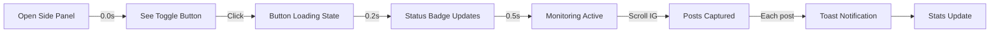
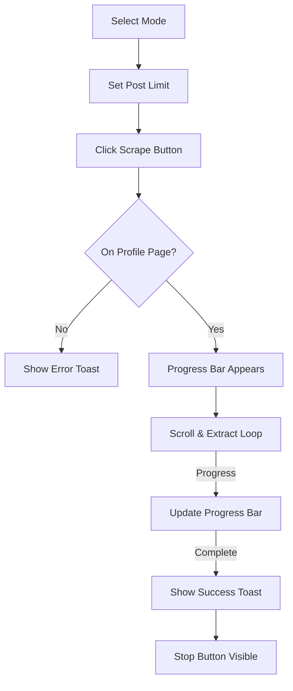
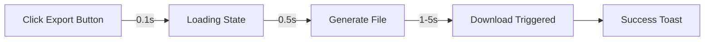

> ⚠️ **DOCUMENTO STORICO — SUPERATO.** Descrive la UX dell'Era 1/2 (monitor passivo,
> dashboard multi-feature, animazioni). Il prodotto attuale è il **side panel mono-scopo**
> (Era 3 / Driver A): vedi [README](../README.md), il mockup `apify-parity/ui-mockup/sidepanel-mockup-v2.html`
> e `apify-parity/`. Conservato come archivio di design.

# 🎨 InstaGhost UX Design Specification

## Role: Marcus Rodriguez, Principal UX Designer

---

## 📋 Table of Contents

1. [Extension Overview](#extension-overview)
2. [User Personas & Primary Actions](#user-personas)
3. [Chrome Extension Constraints](#constraints)
4. [Design System](#design-system)
5. [Component Specifications](#components)
6. [User Flows](#user-flows)
7. [Accessibility Compliance](#accessibility)
8. [Current Implementation Status](#implementation)
9. [Future Roadmap](#roadmap)

---

## 📱 Extension Overview {#extension-overview}

**Name:** InstaGhost (Instagram Post Monitor)  
**Version:** 1.2.0  
**Manifest:** V3  
**Primary Interface:** Chrome Side Panel (not popup)

### Key Features Requiring UI

| Feature | UI Element | Priority |
|---------|-----------|----------|
| Monitoring Toggle | Primary action button | P0 |
| Statistics Display | Stat cards grid | P0 |
| Profile Scraping | Control panel + progress bar | P1 |
| Data Export | Button group | P1 |
| Post Filtering | Checkbox group + inputs | P2 |
| Recent Posts List | Scrollable card list | P2 |
| Clear Data | Danger zone button | P3 |

### Data to Display

- **Aggregate Stats:** Total posts, today's posts, total likes, average likes
- **Type Breakdown:** Images, Reels, Carousels (counts)
- **Post Cards:** Thumbnail, username, caption, likes, time, type
- **Progress:** Scrape status, percentage, ETA

---

## 👤 User Personas {#user-personas}

### Persona 1: Social Media Manager
- **Goals:** Track competitor content, save posts for inspiration
- **Behavior:** Passive monitoring while browsing Instagram
- **Tech Level:** Intermediate

### Persona 2: Research Analyst
- **Goals:** Collect large datasets for analysis
- **Behavior:** Active profile scraping with specific targets
- **Tech Level:** Advanced

### Persona 3: Casual User
- **Goals:** Save interesting posts locally
- **Behavior:** Occasional use, simple exports
- **Tech Level:** Basic

### Primary User Actions (by frequency)

1. **Toggle monitoring** (daily)
2. **View saved posts** (daily)
3. **Export data** (weekly)
4. **Scrape profile** (occasional)
5. **Clear data** (rare)

---

## ⚠️ Chrome Extension UI Constraints {#constraints}

### Side Panel Dimensions
- **Width:** Fixed by Chrome (variable, typically 380-420px)
- **Height:** Full viewport height
- **Scrolling:** Enabled (unlike popups)

### Content Security Policy
| Allowed | Not Allowed |
|---------|-------------|
| External CSS ✅ | Inline styles ❌ |
| External JS ✅ | Inline scripts ❌ |
| Data URIs ✅ | eval() ❌ |
| HTTPS images ✅ | HTTP content ❌ |

### Performance Considerations
- **Initial paint:** < 100ms
- **Interaction ready:** < 300ms
- **Animation budget:** 60fps target

---

## 🎨 Design System {#design-system}

### Color Palette

```css
:root {
    /* Instagram Brand Colors */
    --ig-gradient: linear-gradient(135deg, #833ab4 0%, #fd1d1d 50%, #fcb045 100%);
    --ig-purple: #833ab4;
    --ig-pink: #E4405F;
    --ig-orange: #fcb045;
    
    /* UI Colors - Dark Theme */
    --bg-primary: #0a0a0a;
    --bg-secondary: #111111;
    --bg-tertiary: #181818;
    --bg-card: rgba(24, 24, 24, 0.8);
    
    /* Text Colors */
    --text-primary: #ffffff;
    --text-secondary: #b3b3b3;
    --text-muted: #666666;
    
    /* Semantic Colors */
    --success: #22c55e;
    --warning: #f59e0b;
    --danger: #ef4444;
    --info: #3b82f6;
}
```

### Typography

| Element | Font | Size | Weight |
|---------|------|------|--------|
| Logo | Inter | 20px | 700 |
| Section Title | Inter | 14px | 600 |
| Body | Inter | 14px | 400 |
| Caption | Inter | 12px | 400 |
| Stat Value | Inter | 28px | 700 |
| Button | Inter | 14-16px | 600 |

### Spacing Scale

```css
--space-xs: 4px;   /* Tight gaps */
--space-sm: 8px;   /* Icon gaps */
--space-md: 16px;  /* Section padding */
--space-lg: 24px;  /* Major sections */
--space-xl: 32px;  /* Header height */
```

### Border Radius

```css
--radius-sm: 10px;   /* Inputs, small buttons */
--radius-md: 14px;   /* Cards, buttons */
--radius-lg: 20px;   /* Stat cards */
--radius-xl: 24px;   /* Large containers */
--radius-full: 50px; /* Pills, badges */
```

### Shadows & Effects

```css
/* Glass morphism */
--glass-bg: rgba(20, 20, 20, 0.6);
--glass-blur: blur(20px);

/* Glow effects */
--glow-purple: 0 0 40px rgba(131, 58, 180, 0.4);
--glow-success: 0 0 20px rgba(34, 197, 94, 0.4);

/* Depth shadows */
--shadow-sm: 0 2px 8px rgba(0, 0, 0, 0.3);
--shadow-md: 0 8px 24px rgba(0, 0, 0, 0.4);
--shadow-lg: 0 16px 48px rgba(0, 0, 0, 0.5);
```

---

## 🧩 Component Specifications {#components}

### Component: Header

#### Purpose
Displays branding and monitoring status with sticky positioning.

#### Visual Design
```
┌────────────────────────────────────────┐
│ 👻 InstaGhost         ● Attivo         │
│ [========== ▶️ Avvia Monitor ==========] │
└────────────────────────────────────────┘
```

- **Size:** Full width × 120px
- **Background:** Gradient blur (rgba(10,10,10,0.95))
- **Position:** Sticky top

#### States
| State | Visual |
|-------|--------|
| Inactive | Gray badge, "Inattivo" |
| Active | Green badge + pulse, "Attivo" |

#### HTML Structure
```html
<header class="header">
  <div class="header-top">
    <div class="logo">
      <span class="logo-icon">👻</span>
      <span class="logo-text">Insta<span class="logo-highlight">Ghost</span></span>
    </div>
    <div class="status-badge" id="statusBadge">
      <span class="status-dot"></span>
      <span class="status-text">Inattivo</span>
    </div>
  </div>
  <button id="toggleBtn" class="btn btn-primary btn-large">
    <span class="btn-icon">▶️</span>
    <span class="btn-text">Avvia Monitor</span>
  </button>
</header>
```

---

### Component: Stat Card

#### Purpose
Displays a single metric with gradient styling.

#### Visual Design
```
┌─────────────────┐
│      1,234      │  ← Gradient text
│   Post Totali   │  ← Muted label
│ ══════════════  │  ← Gradient bottom border
└─────────────────┘
```

- **Size:** Flexible grid (50% width)
- **Padding:** 18px 14px
- **Border-radius:** 20px

#### States
| State | Effect |
|-------|--------|
| Default | Glass background |
| Hover | Lift (translateY -4px) + rotating gradient border |
| Primary | Gradient background highlight |

#### Animations
- **Counter flip:** 0.15s rotateX on value change
- **Glow pulse:** 0.5s on update
- **Border rotation:** 3s infinite on hover (CSS Houdini)

---

### Component: Post Item Card

#### Purpose
Displays a saved post with thumbnail and metadata.

#### Visual Design
```
┌─────────────────────────────────────┐
│ ┌────┐  @username                   │
│ │ 📷 │  Caption text truncated...   │
│ └────┘  ❤️ 1.2K  🕒 2h ago  📷      │
│ =========                           │  ← Hover: gradient left border
└─────────────────────────────────────┘
```

- **Size:** Full width × 72px
- **Gap:** 14px between items
- **Thumbnail:** 52×52px, border-radius 14px

#### States
| State | Effect |
|-------|--------|
| Default | Glass background |
| Hover | 3D tilt + spotlight + translateX(6px) |
| Active | Scale 0.98 |

#### Accessibility
- **Role:** button (clickable to open post)
- **Focus:** Visible outline with glow
- **Keyboard:** Enter/Space to activate

---

### Component: Progress Bar

#### Purpose
Shows scraping progress with shimmer animation.

#### Visual Design
```
┌─────────────────────────────────────┐
│ Caricamento...              45/100  │
│ [████████░░░░░░░░░░░░] 45%          │
│         ETA: ~2 minuti              │
└─────────────────────────────────────┘
```

- **Height:** 10px bar
- **Fill:** Instagram gradient
- **Effect:** Shimmer animation (1.5s infinite)

---

### Component: Button Variants

| Variant | Use Case | Style |
|---------|----------|-------|
| Primary | Main actions | Instagram gradient, white text |
| Secondary | Secondary actions | Glass bg, light text |
| Accent | Scrape button | Animated gradient |
| Danger | Destructive | Red background |
| Icon | Refresh, etc | 36×36px, icon only |

#### Button States
```
Default → Hover (lift + glow) → Active (scale down) → Disabled (0.5 opacity)
            ↓
        Ripple effect on click
            ↓
        Magnetic pull (primary buttons)
```

---

## 🔄 User Flows {#user-flows}

### Flow 1: Start Monitoring



**Timing:**
- Button response: < 100ms
- Status update: < 500ms
- Toast duration: 3s

**Error States:**
- Not on Instagram: "Vai su Instagram e avvia il monitor"
- Connection lost: Auto-reconnect with retry

---

### Flow 2: Profile Scraping



**Timing:**
- Fast mode: ~60 posts/min
- Hybrid mode: ~30 posts/min
- Full mode: ~15 posts/min

---

### Flow 3: Export Data



**Formats:**
- JSON: Raw data
- CSV: Spreadsheet compatible
- HTML: Visual report

---

## ♿ Accessibility Compliance {#accessibility}

### WCAG 2.1 AA Checklist

| Requirement | Status | Implementation |
|-------------|--------|----------------|
| Color contrast ≥ 4.5:1 | ✅ | White on dark (#fff on #0a0a0a = 18.5:1) |
| Large text ≥ 3:1 | ✅ | Gradient text has underlining/glow fallback |
| Keyboard accessible | ✅ | All buttons focusable, Enter/Space activate |
| Focus indicators | ✅ | 2px pink outline + 4px glow |
| Screen reader labels | ✅ | aria-label on all buttons |
| Color-only info | ✅ | Icons + text labels |
| Touch targets ≥ 44px | ✅ | All buttons min 44px |
| Reduced motion | ✅ | `@media (prefers-reduced-motion)` |

### ARIA Implementation

```html
<!-- Status badge -->
<div class="status-badge" role="status" aria-live="polite">
  <span class="status-text">Attivo</span>
</div>

<!-- Export button -->
<button 
  class="btn" 
  aria-label="Esporta dati in formato JSON"
  aria-busy="false"
>
  📄 Export JSON
</button>

<!-- Post list -->
<div 
  class="posts-list" 
  role="list" 
  aria-label="Post salvati recenti"
>
  <div class="post-item" role="listitem" tabindex="0">...</div>
</div>
```

### Reduced Motion Support

```css
@media (prefers-reduced-motion: reduce) {
    *, *::before, *::after {
        animation-duration: 0.01ms !important;
        transition-duration: 0.01ms !important;
    }
}
```

---

## ✅ Current Implementation Status {#implementation}

### Implemented Features (10/10 Phases)

| Phase | Feature | Lines Added |
|-------|---------|-------------|
| 1 | Glassmorphism + Noise | ~50 CSS |
| 2 | Animated Gradient Borders | ~40 CSS |
| 3 | Skeleton Loading | ~30 CSS |
| 4 | Button Ripple | ~30 CSS + JS |
| 5 | Flip Counters | ~40 JS |
| 6 | 3D Card Tilt | ~50 JS |
| 7 | Floating Particles | ~40 CSS + JS |
| 8 | Magnetic Buttons | ~30 JS |
| 9 | Milestone Confetti | ~70 JS |
| 10 | Logo Animation | ~30 CSS |
| ♿ | Reduced Motion | ~20 CSS |

**Total Added:**
- CSS: 1,241 → 1,806 lines (+565)
- JS: 761 → 1,035 lines (+274)
- HTML: 260 → 263 lines (+3)

---

## 🚀 Future Roadmap {#roadmap}

### Short Term (v1.3)

- [ ] **Dark/Light Mode Toggle** - Respect system preference with override
- [ ] **Keyboard Shortcuts** - Ctrl+Shift+M to toggle monitoring
- [ ] **Post Preview Modal** - In-extension post preview without navigating

### Medium Term (v1.4)

- [ ] **Analytics Dashboard** - Charts for engagement trends
- [ ] **Saved Collections** - Organize posts into folders
- [ ] **Scheduled Exports** - Auto-export on schedule

### Long Term (v2.0)

- [ ] **Multi-account Support** - Track multiple Instagram accounts
- [ ] **Cloud Sync** - Sync data across devices
- [ ] **Browser Action Badge** - Show live post count on extension icon

---

## 📐 Responsive Considerations

### Width Breakpoints

| Width | Layout Adjustments |
|-------|-------------------|
| < 350px | Stack stat cards vertically |
| 350-420px | 2-column stat grid (default) |
| > 420px | Extra padding, larger text |

### Height Considerations

- Sticky header: Fixed at top
- Scrollable content: Stats, Posts, Filters
- Footer: Fixed at bottom (auto hidden when scrolling)

---

## 🎯 Success Metrics

| Metric | Target | Measurement |
|--------|--------|-------------|
| First Impression | "WOW" | User testing |
| Time to First Action | < 2s | Analytics |
| Animation Smoothness | 60fps | Chrome DevTools |
| Accessibility Score | 100% | Lighthouse |
| Error Rate | < 1% | Error logging |

---

## 📄 Document Information

- **Author:** Marcus Rodriguez (NSA UX Design Workflow)
- **Created:** 2025-12-29
- **Last Updated:** 2025-12-29
- **Version:** 1.0

---

> ✅ **UX Specification Complete**
> 
> This document covers all UI/UX aspects of the InstaGhost Chrome extension.
> All 10 spectacular design phases have been implemented.
> 
> **Next Step:** Run `/nsa-test` to validate implementation in browser.
